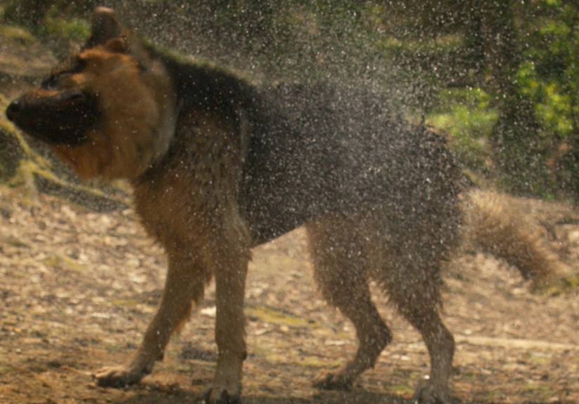
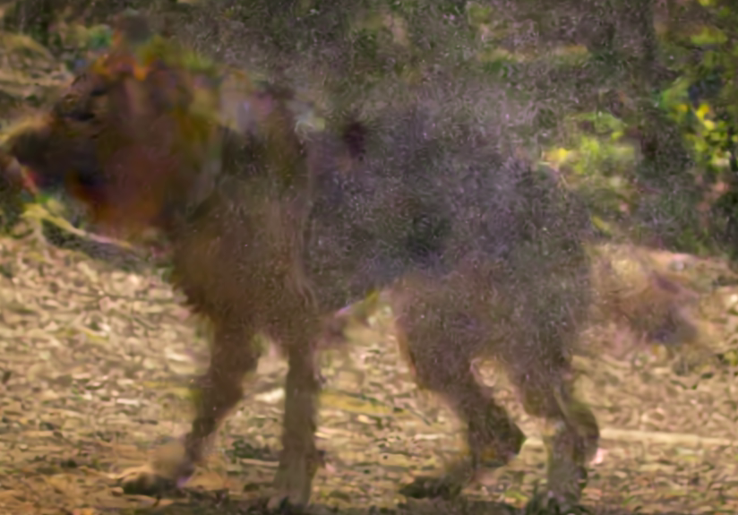
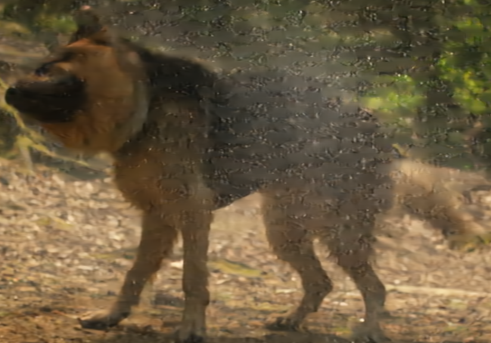

# RobustNVC
A Vision-Transformer-based neural video codec that is robust to network packet losses. 

It achieves superior loss resilience performance than [Grace](https://github.com/UChi-JCL/Grace/tree/master)(NSDI 2024) and [DCVC-DC](https://github.com/microsoft/DCVC/tree/main/DCVC-DC) (CVPR 2023).

Inference examples with `50% packet loss` of `RobustNVC` and `DCVC-DC` (with and without retransmission) under the same network bandwidth and transmission time (`RTX` means retransmission and `RTT` means network round-trip time ):

| Original | DCVC-DC(w/o RTX) | DCVC-DC(RTX, RTT=10) |RobustNVC(w/o RTX) |
|----------|----------|----------|----------|
|  |  |  |  |
|  |  |  |  |
|  |  |  |  |

## Check out later for updates!
